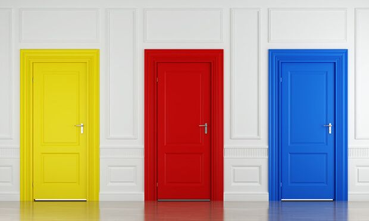
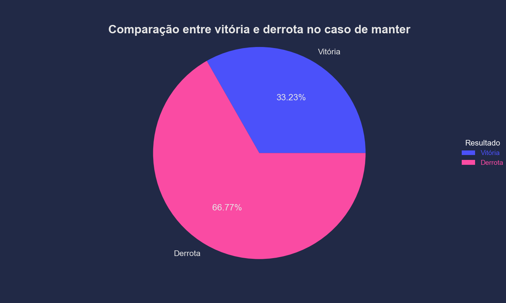
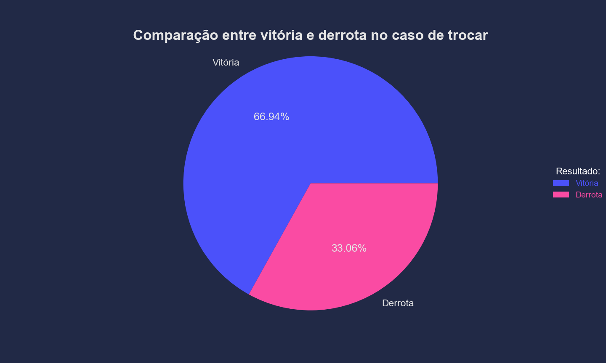

# Paradoxo de Monty Hall
Autor: Victor Flávio P. Dornelos \
Email: victor.dornelos@hotmail.com
 

##### Fonte: https://pin.it/2z9UThYk0

# O que é o Paradoxo de Monty Hall?
Durante o game show americano “Lets’s Make a Deal”, apresentado por Monty Hall, era apresentado 3 portas onde uma delas havia um carro e nas outras, uma cabra. Dessa forma, primeiro, o participante escolhia uma porta aleatoriamente, depois, o apresentador (que sabe onde está o prêmio) abria uma outra porta em que estava uma cabra e fornecia a opção de trocar sua escolha inicial ou manter.

Diante isso, a jornalista Marilyn Vos Savant, que tinha o título no Quinnes Book de ser a mulher com o maior QI do mundo, afirmou que trocar a porta teria o dobro de possibilidade de vitória. Após essa afirmação, Marilyn recebeu milhares de cartas de matemáticos contrariando sua resposta, assim, criando o Paradoxo de Monty Hall. Porém, apesar de todas as críticas mais tarde foi comprovado que a afirmação da jornalista está correta.

# Solução:

O paradoxo de Monty Hall, aconteceu porque o cérebro humano naturalmente é levado a pensar que pelo fato de 2 portas fechadas, então haveria 50% de chance de ganhar o carro para cada decisão, não existindo diferença entre trocar ou manter a porta, todavia, quando se escolhe a primeira porta as chances eram de 1/3 e as duas portas restante teria 2/3. Nesse sentido, quando o apresentador abre uma das portas com a cabra e oferece a decisão de trocar a porta, o novo cenário será manter escolha inicial que tinha 1/3 de chance ou trocar para porta que tem 2/3, uma vez que o apresentador abriu uma das portas e mostrou a cabra. Logo, a decisão de trocar a porta tem o dobro de probabilidade de ganhar o carro.

# Demonstração:
A Lei de Grandes Números, afirma que com um grande número de experimentos independentes, a média dos resultados encontrado será o valor esperado aproximado. Dessa forma, ao simular um grande número de partidas desse jogo na linguagem de programação Python é possível comprovar estatisticamente que a melhor decisão é trocar a porta. Portanto, conforme mostra os gráficos abaixo ao realizar 100 mil vezes o jogo, a decisão de trocar a porta terá aproximadamente o dobro de chance de vitória.

# Referência:
https://www.youtube.com/watch?v=XJFEjl3lPBM\
https://www.youtube.com/watch?v=fxlUKMHGTdE&t=239s

